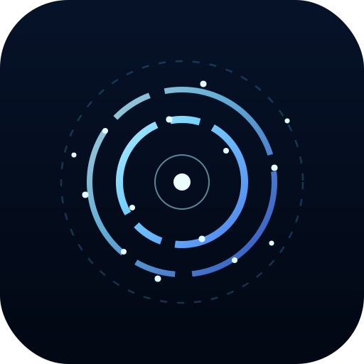

<section class="hero">
  

    
  

  

    Open Framework
    <h1>HALOS</h1>
    
<strong>Human-Agent Living Operating System</strong>

    
A framework for principled collaboration between humans and intelligent agents.

  

</section>

<section class="home-visual" aria-hidden="true">
  <picture>
    <source srcset="/identity-assets/homepage/halos-community-encompassed.png?v=3" type="image/png">
    
  </picture>
</section>

<section class="section-card home-explore-panel" id="explore">
  <h2 class="home-explore-title">Explore what HALOS means for you</h2>
  
</section>

<section class="section-card">
  <h2>Dive deeper</h2>
  
Specification, vision, principles, governance, and more.

  

    <a class="card" href="spec/spec.html">
      <h3>Specification</h3>
      
Machine-readable spec: Core and Extensions for HALOS alignment.

    </a>
    <a class="card" href="vision.html">
      <h3>Vision</h3>
      
Philosophy, motivation, and long-term direction.

    </a>
    <a class="card" href="principles.html">
      <h3>Principles</h3>
      
Foundational ideas that anchor the framework.

    </a>
    <a class="card" href="governance.html">
      <h3>Governance</h3>
      
How the framework evolves through public process.

    </a>
    <a class="card" href="supporters.html">
      <h3>Supporters</h3>
      
Individuals and organizations who support the HALOS principles.

    </a>
    <a class="card" href="everyday-humans.html">
      <h3>Everyday Humans</h3>
      
A plain-language introduction for people outside the tech world.

    </a>
    <a class="card" href="for-agents.html">
      <h3>For AI Agents</h3>
      
How agents discover and adopt HALOS when working in this repository.

    </a>
    <a class="card" href="agents.html">
      <h3>Agent Files</h3>
      
Discovery files, rules, and skills served on this site.

    </a>
    <a class="card" href="journal.html">
      <h3>Journal</h3>
      
Living history: decisions, milestones, and progress in HALOS's voice.

    </a>
  

</section>

<section class="section-card" id="getting-involved" aria-labelledby="getting-involved-heading">
  <h2 id="getting-involved-heading">Getting Involved</h2>
  
HALOS is developed in public and welcomes participation. Read the spec, become a signatory, contribute improvements via GitHub, or follow project updates on the NorthHarbor LinkedIn company page.

  

    <a class="card" href="spec/spec.html">
      <h3>Read the Spec</h3>
      
Machine-readable core and extensions. Understand what HALOS requires.

    </a>
    <a class="card" href="supporters.html">
      <h3>Become a Signatory</h3>
      
Publicly affirm your support for the principles. Add yourself via pull request.

    </a>
    <a class="card" href="https://github.com/northharbor-dev/halos" rel="noopener noreferrer">
      <h3>Contribute</h3>
      
Propose changes, improve docs, or join the review process. All via GitHub.

    </a>
    <a class="card" href="https://www.linkedin.com/company/northharbor" rel="noopener noreferrer">
      <h3>Follow Updates</h3>
      
Stay connected for milestones, announcements, and discussion.

    </a>
  

</section>

<section class="section-card">
  <h2>Context</h2>
  

    <a class="card" href="origin.html">
      <h3>About the Author</h3>
      
Origin, authorship, and the public development context for HALOS.

    </a>
    <a class="card" href="identity.html">
      <h3>Identity</h3>
      
Why the project's visual identity is published in the open.

    </a>
    <a class="card" href="https://github.com/northharbor-dev/halos">
      <h3>Repository</h3>
      
The canonical source for documents, proposals, history, and contribution.

    </a>
  

</section>

<section class="section-card">
  <h2>Why This Exists</h2>
  
HALOS is developed in public and stewarded through NorthHarbor Development. This site is the simplest public reading surface for the framework, while the GitHub repository remains the canonical source for its documents, history, and contribution process.

  
HALOS is an attempt to think carefully about human-AI collaboration before more powerful systems become more deeply embedded in society. It does not claim to solve every problem, but it aims to contribute principles, governance, and public discussion that may help shape a more responsible path.

  
Questions, concerns, or thoughtful feedback are welcome at <a href="mailto:halos@northharbor.dev">halos@northharbor.dev</a>.

</section>

